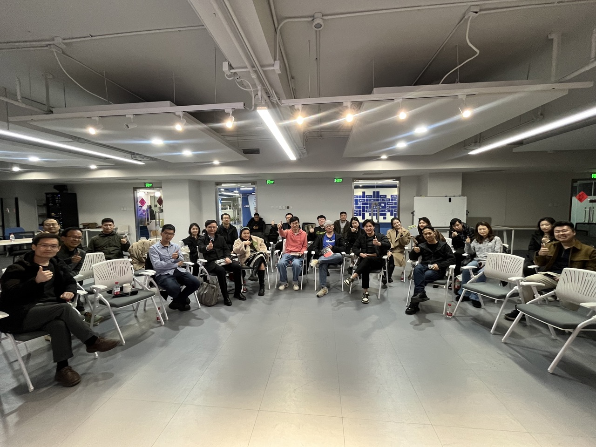

# 太理 2025 开年分享交流会

<div align="center">
  
</div>

<p align="center">
  记录南川太理 2025 年开年分享交流会的精彩瞬间
</p>

<p align="center">
  <a href="#内容"><strong>内容</strong></a> ·
  <a href="#技术栈"><strong>技术栈</strong></a> ·
  <a href="#本地开发"><strong>本地开发</strong></a>
</p>

## 内容

- 📸 精美的封面展示
- 🎙️ 语音素材资料（即将推出）
- 📝 会议记录与总结
- 🌟 精彩瞬间回顾

## 技术栈

- 🚀 [Next.js 14](https://nextjs.org) App Router
- 🎨 [Tailwind CSS](https://tailwindcss.com)
- 🖼️ 响应式设计
- 🌓 暗色模式支持

## 本地开发

1. 安装依赖
```bash
pnpm install
```

2. 启动开发服务器
```bash
pnpm dev
```

## 项目结构

```
.
├── app/                # Next.js App Router
├── components/         # React 组件
├── public/            # 静态资源
└── styles/            # 样式文件
```
